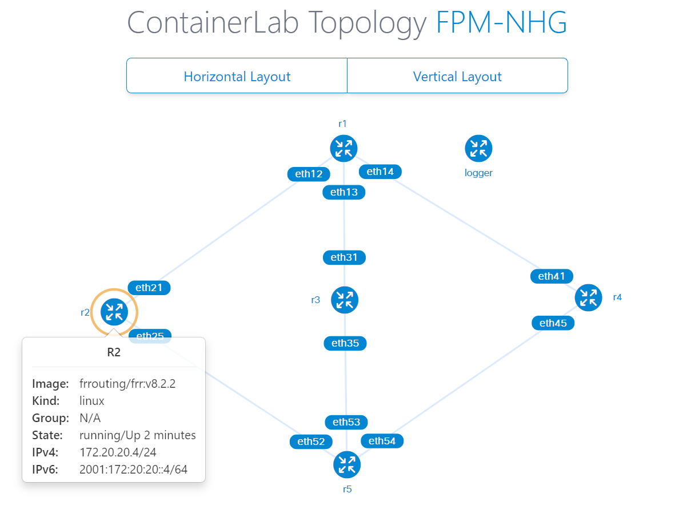

# Fpm monitoring using containerlab

（日本語） Japanese version: https://zenn.dev/ebiken_sdn/articles/82d09a55a7e90e

- [Background:](#background)
- [Environment](#environment)
- [basic operations](#basic-operations)
  - [fpm-logger](#fpm-logger)
  - [ContainerLab](#containerlab)
  - [viewing graphical representations of a topology](#viewing-graphical-representations-of-a-topology)
- [NHG testing using 5 nodes](#nhg-testing-using-5-nodes)
  - [IP Address Assignments](#ip-address-assignments)
  - [FRR BGP config for multipath](#frr-bgp-config-for-multipath)
  - [fpm netlink msg with NHG](#fpm-netlink-msg-with-nhg)
- [Check how NHG is announced via FPM](#check-how-nhg-is-announced-via-fpm)

## Background:

FRR on SONiC utilize [FPM (Forwarding Plane Manager)](https://docs.frrouting.org/projects/dev-guide/en/latest/fpm.html) to communicate route (FIB) information to SONiC.
`fpmsyncd` is a daemon in charge of receiving FIB sate from zebra via FPM and inserting into `APPL_DB`.

Currently (in the latest SONiC 202305 release) `fpmsyncd` does not support handling Next Hop Group (NHG) while `APPL_DB` and `swss/orchagent` does support NHG. (e.g. handle `RTM_NEWNEXTHOP` and `RTM_DELNEXTHOP` netlink message)

> [HLD: Routing and Next Hop Table Enhancement](https://github.com/sonic-net/SONiC/blob/master/doc/ip/next_hop_group_hld.md)
> : `2.5 Restrictions: fpmsyncd is not updated to use the new NEXT_HOP_GROUP_TABLE as part of this enhancement. Anyone wishing to use this feature must use a modified version of fpmsyncd, or program the table directly.`

Thus, we are proposing to extend `fpmsyncd` to support NHG.
Refere to below draft HLD and PR for design and discussion in the community.
  - [HLD: fpmsyncd NextHop Group Enhancement](https://github.com/ntt-omw/SONiC/blob/fpmsyncd/doc/fpmsyncd/hld_fpmsyncd-NTT.md
)
  - [PR#1425](https://github.com/sonic-net/SONiC/pull/1425)
As a first step to extend `fpmsyncd` to support NHG, this document describes how to monitor messages from FPM and light weight lab for testing in a single server using ContainerLab.

## Environment

- host: Ubuntu 20.04.4 LTS (5.4.0-153-generic)
- FRR: v8.2.2 (image: frrouting/frr:v8.2.2)
- FRR FPM module: dplane_fpm_nl
- ContainerLab: v0.43.0 (commit: c90be25c, 2023-07-26T16:29:09Z)
- fpm-logger: yutarohayakawa/fpm-logger:latest

## basic operations

### fpm-logger

[fpm-logger](https://github.com/YutaroHayakawa/fpm-logger) will be used to monitor fpm message sent from FRR/zebra.

> See [Zenn: Playing around with the FRR FPM (Forwarding Plane Manager)](https://zenn.dev/yutarohayakawa/articles/c0abeed192ceda) for more details.

After starting docker container running `fpm-logger` using ContainerLab, just enter below command to monitor fpm netlink message.

```
$ docker logs clab-fpm-nhg-logger -f
```

Example of fpm netlink messages:

```
[NEXTHOP]id 26 via 192.168.12.2 dev eth12 proto zebra
[NEXTHOP]id 27 via 192.168.13.3 dev eth13 proto zebra
[NEXTHOP]id 28 via 192.168.14.4 dev eth14 proto zebra
[NEXTHOP]id 25 group 26/27/28 proto zebra
[ROUTE]10.99.0.0 nhid 25 proto bgp metric 20
```

### ContainerLab

Refer to below official docs for more details.

- quick start: https://containerlab.dev/quickstart/
- lab examples: https://containerlab.dev/lab-examples/lab-examples/


ContainerLab topology file `topo.yaml` and FRR config files are stored under `fpm-nhg/`.

Install ContainerLab.

```
$ bash -c "$(curl -sL https://get.containerlab.dev)"
```

Start ContainerLab (deploy)

```
$ cd fpm-nhg

$ sudo clab deploy -t topo.yaml
```

Stop ContainerLab (destroy)

```
$ sudo clab destroy -t topo.yaml
```

### viewing graphical representations of a topology

> For more details, check: https://containerlab.dev/cmd/graph/

Using `clab graph` command, one can generate an HTTP page.

1. Allow access to port 50080 `$ sudo ufw allow 50080/tcp`
2. run http server serving graph
    ```
    $ sudo clab graph -t topo.yaml
    INFO[0000] Parsing & checking topology file: topo.yaml
    INFO[0000] Serving static files from directory: /etc/containerlab/templates/graph/nextui/static
    INFO[0000] Serving topology graph on http://0.0.0.0:50080
    ```
3. access from browser `http://<host-ip>:50080/`

## NHG testing using 5 nodes

`fpm-nhg/topo.yaml` will create a lab with 5 FRR nodes + fpm-logger.



```
$ cd fpm-nhg
$ sudo clab deploy -t topo.yaml

...snip...

+---+---------------------+--------------+----------------------------------+-------+---------+----------------+----------------------+
| # |        Name         | Container ID |              Image               | Kind  |  State  |  IPv4 Address  |     IPv6 Address     |
+---+---------------------+--------------+----------------------------------+-------+---------+----------------+----------------------+
| 1 | clab-fpm-nhg-logger | 3262744ddb66 | yutarohayakawa/fpm-logger:latest | linux | running | N/A            | N/A                  |
| 2 | clab-fpm-nhg-r1     | 35f5154389f3 | frrouting/frr:v8.2.2             | linux | running | 172.20.20.3/24 | 2001:172:20:20::3/64 |
| 3 | clab-fpm-nhg-r2     | e26b3173c35e | frrouting/frr:v8.2.2             | linux | running | 172.20.20.4/24 | 2001:172:20:20::4/64 |
| 4 | clab-fpm-nhg-r3     | 5da29c9fd739 | frrouting/frr:v8.2.2             | linux | running | 172.20.20.5/24 | 2001:172:20:20::5/64 |
| 5 | clab-fpm-nhg-r4     | 13cffc8f0f16 | frrouting/frr:v8.2.2             | linux | running | 172.20.20.2/24 | 2001:172:20:20::2/64 |
| 6 | clab-fpm-nhg-r5     | 5c869c89894c | frrouting/frr:v8.2.2             | linux | running | 172.20.20.6/24 | 2001:172:20:20::6/64 |
+---+---------------------+--------------+----------------------------------+-------+---------+----------------+----------------------+
```

### IP Address Assignments

FPM netlink message is monitored on `r1`. Container `logger` is sharing network stack with `r1`, thus it could just listen to `127.0.0.1:2620` locally.

see `network-mode: container:r1` in [fpm-nhg/topo.yaml](./fpm-nhg/topo.yaml)

```
    logger:
      kind: linux
      image: yutarohayakawa/fpm-logger:latest
      network-mode: container:r1
      startup-delay: 3
      cmd: "bash -c \"fpm-logger | ip monitor all file /dev/stdin\""
```

Since I wanted to get NH announced using IPv4 address and dev name, IPv4 address is assigned to the link between `r1` and other 3 intermediate routers, `r2` `r3` `r4`.

[r1.frr.conf](./fpm-nhg/frr/r1.frr.conf)

```
interface eth12
 ip address 192.168.12.1/24
!
interface eth13
 ip address 192.168.13.1/24
!
interface eth14
 ip address 192.168.14.1/24
```

As an example of extended-nexthop,  [RFC8950](https://datatracker.ietf.org/doc/html/rfc8950), IPv4 was not assigned to the link between `r5` and `r2` `r3` `r4`.

Note there is no IPv4 address related config in [r5.frr.conf](./fpm-nhg/frr/r5.frr.conf) (unlike `r1.frr.conf`)

```
hostname r5
no ipv6 forwarding
!
router bgp 65005
 bgp router-id 10.0.0.5
 no bgp ebgp-requires-policy
 bgp bestpath as-path multipath-relax
 neighbor eth52 interface remote-as external
 neighbor eth53 interface remote-as external
 neighbor eth54 interface remote-as external
 !
 address-family ipv4 unicast
  redistribute connected
 exit-address-family
exit
```

### FRR BGP config for multipath

To let BGP to inject multipath route to FIB, use `bgp bestpath as-path multipath-relax`

[r1.frr.conf](./fpm-nhg/frr/r1.frr.conf)

```
router bgp 65001
 bgp router-id 10.0.0.1
 no bgp ebgp-requires-policy
 bgp bestpath as-path multipath-relax
 neighbor 192.168.12.2 remote-as external
 neighbor 192.168.13.3 remote-as external
 neighbor 192.168.14.4 remote-as external
```

### fpm netlink msg with NHG

Now one can enter below commands to let `r5` announce routes to `r2` `r3` `r4`, which will be multipath route using NHG in `r1`.

```
docker exec -it clab-fpm-nhg-r5 ip addr add 10.99.0.0/32 dev lo
docker exec -it clab-fpm-nhg-r5 ip addr add 10.99.0.1/32 dev lo
docker exec -it clab-fpm-nhg-r5 ip addr add 10.99.0.2/32 dev lo

docker exec -it clab-fpm-nhg-r5 ip addr del 10.99.0.0/32 dev lo
docker exec -it clab-fpm-nhg-r5 ip addr del 10.99.0.1/32 dev lo
docker exec -it clab-fpm-nhg-r5 ip addr del 10.99.0.2/32 dev lo
```

FPM message will be below for each of above command.
You can find NHG `nhid 25` (a group of nh 26/27/28) is used for 2nd and 3rd route.

```
[NEXTHOP]id 26 via 192.168.12.2 dev eth12 proto zebra
[NEXTHOP]id 27 via 192.168.13.3 dev eth13 proto zebra
[NEXTHOP]id 28 via 192.168.14.4 dev eth14 proto zebra
[NEXTHOP]id 25 group 26/27/28 proto zebra
[ROUTE]10.99.0.0 nhid 25 proto bgp metric 20

[ROUTE]10.99.0.1 nhid 25 proto bgp metric 20

[ROUTE]10.99.0.2 nhid 25 proto bgp metric 20

[ROUTE]Deleted none 10.99.0.0 proto bgp metric 20

[ROUTE]Deleted none 10.99.0.1 proto bgp metric 20

[ROUTE]Deleted none 10.99.0.2 proto bgp metric 20
```

## Check how NHG is announced via FPM

> - Host kernel version: 5.15.0-83-generic
> - FRR version: frrouting/frr:v8.2.2

Create topology

```
$ cd fpm-nhg
$ sudo clab deploy -t topo.yaml
```

Monitor fpm-logger (connected to r1)

```
$ docker logs clab-fpm-nhg-logger -f
```

Connect to vtysh of r5 and add `router bgp 65005; network 10.99.0.0/32` config

```
$ docker exec -it clab-fpm-nhg-r5 vtysh

r5# configure
r5(config)# router bgp 65005
r5(config-router)# network 10.99.0.0/32
r5(config-router)# end
```

Add address to the `lo`` of r5 so it will be advertized to r1 via r2,r3,r4.

```
$ docker exec -it clab-fpm-nhg-r5 ip addr add 10.99.0.0/32 dev lo
```

r1 will receive route from r2,r3,r4, which will be ECMP route.

fpm-logger will show the message to configure NH, NHG and ROUTE.

```
[NEXTHOP]id 26 via 192.168.12.2 dev eth12 proto zebra
[NEXTHOP]id 27 via 192.168.13.3 dev eth13 proto zebra
[NEXTHOP]id 28 via 192.168.14.4 dev eth14 proto zebra
[NEXTHOP]id 25 group 26/27/28 proto zebra
[ROUTE]10.99.0.0 nhid 25 proto bgp metric 20
```

FYI: Routing / NHG information on r1

```
r1# show ip route
Codes: K - kernel route, C - connected, S - static, R - RIP,
       O - OSPF, I - IS-IS, B - BGP, E - EIGRP, N - NHRP,
       T - Table, v - VNC, V - VNC-Direct, A - Babel, F - PBR,
       f - OpenFabric,
       > - selected route, * - FIB route, q - queued, r - rejected, b - backup
       t - trapped, o - offload failure

K>* 0.0.0.0/0 [0/0] via 172.20.20.1, eth0, 00:16:38
B>* 10.99.0.0/32 [20/0] via 192.168.12.2, eth12, weight 1, 00:04:31
  *                     via 192.168.13.3, eth13, weight 1, 00:04:31
  *                     via 192.168.14.4, eth14, weight 1, 00:04:31
C>* 172.20.20.0/24 is directly connected, eth0, 00:16:38
C>* 192.168.12.0/24 is directly connected, eth12, 00:16:38
C>* 192.168.13.0/24 is directly connected, eth13, 00:16:38
C>* 192.168.14.0/24 is directly connected, eth14, 00:16:38


r1# show nexthop-group rib
...snip...
ID: 25 (zebra)
     RefCnt: 1
     Uptime: 00:05:03
     VRF: default
     Valid, Installed
     Depends: (26) (27) (28)
           via 192.168.12.2, eth12 (vrf default), weight 1
           via 192.168.13.3, eth13 (vrf default), weight 1
           via 192.168.14.4, eth14 (vrf default), weight 1
```