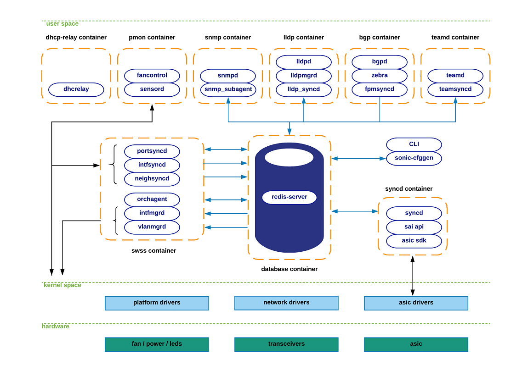

# SONiCアーキテクチャ

> SONiCアーキテクチャの全体像と、各サブシステムやモジュール間の連携方法（の一部）は、公式SONiCレポジトリのWiki [GiHub: SONiC > Wiki/Architecture](https://github.com/sonic-net/SONiC/wiki/Architecture) にて解説されている。
> 公式な情報が必要な場合はこちらを参照のこと。

目次
- [アーキテクチャの全体像](#アーキテクチャの全体像)
- [主要なサブシステムやモジュールの概要](#主要なサブシステムやモジュールの概要)
  - [database container](#database-container)
  - [CLI / sonic-cfggen](#cli--sonic-cfggen)
  - [swss container](#swss-container)
  - [syncd container](#syncd-container)
  - [bgp container](#bgp-container)
- [フロントパネルインターフェースと仮想インターフェース](#フロントパネルインターフェースと仮想インターフェース)
- [TODO：各コンテナのネットワーク](#todo各コンテナのネットワーク)


## アーキテクチャの全体像


> 図（引用）section4_images/section4_pic1_high_level.png https://github.com/sonic-net/SONiC/wiki/Architecture

SONiCはそれぞれ異なる機能を担うサブシステムが連携して動作しています。
上記は公式Wikiから抜粋した図でその概要を示しています。
**現在は上記図に記載されているコンテナ以外も追加されている事に注意してください（TODO：最新の図を作成しリプレース）**

各機能を担うサブシステムはコンテナとして分離動作する事により、プラットフォーム（ハードウェアやホストOS）に依存せず機能を提供する事が可能となります。
例外は `CLI` と `sonic-cfggen` で、これらモジュールはホストOS上で動作しています。

> 参考：SONiCで起動している Docker コンテナの一覧（バージョンや有効にしている機能により異なります）
> ```
> admin@sonic:~$ docker ps --format "table {{.Names}}\t{{.Image}}\t{{.Command}}" --no-trunc
> NAMES            IMAGE                                COMMAND
> snmp             docker-snmp:latest                   "/usr/local/bin/supervisord"
> mgmt-framework   docker-sonic-mgmt-framework:latest   "/usr/local/bin/supervisord"
> telemetry        docker-sonic-telemetry:latest        "/usr/local/bin/supervisord"
> pmon             docker-platform-monitor:latest       "/usr/bin/docker_init.sh"
> lldp             docker-lldp:latest                   "/usr/bin/docker-lldp-init.sh"
> radv             docker-router-advertiser:latest      "/usr/bin/docker-init.sh"
> syncd            docker-syncd-bfn:latest              "/usr/local/bin/supervisord"
> teamd            docker-teamd:latest                  "/usr/local/bin/supervisord"
> swss             docker-orchagent:latest              "/usr/bin/docker-init.sh"
> bgp              docker-fpm-frr:latest                "/usr/bin/docker_init.sh"
> database         docker-database:latest               "/usr/local/bin/docker-database-init.sh"
> ```

各サブシステム（コンテナ）内では実際に機能を提供する各種モジュールが動作しています。
例えば `lldp container` 内では、`lldpd` `lldpmgrd` `lldp_syncd` といったモジュールが動作しています。
モジュールはSONiC用に開発されたものに加え、既存オープンソース実装を利用している場合もあります。
既存オープンソース実装を利用しているモジュールの例としては、 `FRR(bgpd/zebra)` `teamd` `lldpd` 等があります。

各サブシステム（実際には内部で動作するモジュール）は、主に `database container` を介してデータをやりとりする事により連携しています。
SONiC は Redis (https://redis.io/) をデータベースとして利用しています。
Redis は複数のデータベースを保持する事が可能で、それぞれDBID（整数の database id）で識別されます。
SONiC ではそれぞれの役割に応じデータベースに名前（DB名）を付けて管理しており、DB名と Redis DBID との対応（及び各データベース内のテーブル名）は [sonic-swss-common/common/schema.h](https://github.com/sonic-net/sonic-swss-common/blob/master/common/schema.h) に定義されています。
主なDB名（ID）は `APPL_DB(0)`, `ASIC_DB(1)`, `COUNTERS_DB(2)`, `CONFIG_DB(4)`, `STATE_DB(6)` があります。

各サブシステムは `database container` 以外とも連携します。
1つ目はホストOSで、 `netlink` `/sys file-system` `netdev`（仮想デバイス） 等を用いて各種ステートの取得や反映、コントロールパケットの送受信を実施します。
2つ目は Switch ASIC で、ASICベンダが提供する ASIC SDK やドライバを通じて設定の反映、ステータスや統計情報等のやり取りを実施します。
他にも、設定を保存したファイル（例：`config_db.json`）や、CLIを通じたオペレータとの連携、周辺機器（ペリフェラル）とドライバ等を通じた連携があります。


## 主要なサブシステムやモジュールの概要

スイッチをコントロールする "ネットワークOS" としての中心を担う、主要なサブシステムについて概要を説明します。
各サブシステムとモジュールの詳細については、引き続き [各サブシステムやモジュールの役割](sonic-subsystem.md) を参照してください。

最初にアーキテクチャ全体のイメージを掴むためには、以下流れを意識しながら各サブシステムやモジュールの役割を学んでいくと良いでしょう。

- 設定は `CLI / sonic-cfggen` を通じて `CONFIG_DB` に格納され各種モジュールにより利用される
  - 但し、必ずしも全ての設定がデータベースに格納されるわけではない
- 各アプリケーションやホストOS（Kernel）が生成したステートが `*syncd` を通じて `APPL_DB` に格納される
- `APPL_DB` に格納されたステートを、 `orchagent` が ASIC が理解しやすい形式に変換して `ASIC_DB` に投入する
- `ASIC_DB` に格納されたステートを、 `syncd` が `SAI API` を通じて ASIC に投入する


### database container

設定、状態、統計情報など、SONiCで扱うあらゆるデータを格納します。
データを格納するだけでなく、各サブシステム（モジュール）は、Key に対して Subscribe する事により、該当する Key-Value が変更された場合等に通知を受けとり、処理を開始する事も可能です。
すなわち、データベースという名前ですが、実際はデータの格納場所だけでなく、各サブシステム間のデータハブとしても機能しています。

主なDB名（ID）は `APPL_DB(0)`, `ASIC_DB(1)`, `COUNTERS_DB(2)`, `CONFIG_DB(4)`, `STATE_DB(6)` であり、それぞれ以下の役割を持ちます。

- `APPL_DB(0)`
  - 各サブシステム（モジュール）で生成されたオブジェクト情報を格納します。
  - 例えば、ルーティング情報、next-hop、neighbor情報、等があります。
  - サブシステム連携の中核を担う、最も重要なデータベースです。
- `ASIC_DB(1)`
  - ASICをコントロールするために必要な情報を、ASICに親和性の高い形式でデータを保存します。
  - 例えば、SAIに関連するデータは、SAI Object と同様の形式で保存されます。（TODO：要確認）
  - このデータベースに格納されたデータは `syncd container` を通じてASICに反映されます。
- `COUNTERS_DB(2)`
  - 統計情報が格納されます。
  - 例えば、ポート毎のカウンター情報が挙げられます。
  - CLIを通じて参照したり、他のサブシステムによりテレメトリ情報として利用する事が可能です。
- `CONFIG_DB(4)`
  - 設定情報が格納されます。
  - 例えば、物理ポート、インターフェース、VLAN等、あらゆる設定情報を格納可能です。
  - 但し、サブシステムによっては `CONFIG_DB` を利用せず、独自の方法で設定を保持している場合がある事に注意が必要です。
- `STATE_DB(6)`
  - 動作状態（ operational state ）が格納され、相互依存するサブシステム間の連携に利用されます。
  - 例えば LAG の状態が挙げられます。


### CLI / sonic-cfggen

SONiC には、以下2種類の CLI があります。

- Click ベースの CLI
  - Click から `sonic_cfggen` 経由で `CONFIG_DB` や、 `CONFIG_DB` を利用しないモジュールの設定（ファイル）を操作する
    - Click は Python ベースの CLI フレームワーク
    - （TODO: どの操作がどのパスを通るか確認して更新）
  - SONiC の CLI といえば（まだ）これで、多くのコマンドをサポートしている
- Klish ベースの CLI
  - Klish から `SONiC Management Framework` の REST API 経由で `CONFIG_DB` を操作する
    - Klish は Cisco IOS Like な CLI フレームワーク
  - 2019年から開発が進められているが、サポートしているコマンドは限定的

通常 SONiC の CLI といえば前者になり、通常の操作には十分な機能を備えています。
しかし、YANG Model から REST API (OpenAPI) を生成したり、gNMI を利用する場合など、モデルベースの設定管理やAPI生成をしたい場合は `SONiC Management Framework` の利用（拡張）を考慮しても良いと思います。


### swss container

Switch State Service の略である `swss container` は `database container` と共に SONiC システムの中核に位置し、各サブシステムやコンポーネント間を仲介する役割を担う、多くのモジュールから構成されます。

各モジュールは名前毎に以下のような役割を持ちます。なお、`syncd container` と `swss container` 内の `*syncd` モジュールを混同しないように注意が必要です。また、これはあくまでも目安であり、以下に記載した以外の役割も担っている場合があります。

- `*syncd` モジュール
  - 主にデータベースに対する Publisher の役割を担い、各機能を担うモジュール（アプリケーション）が収集したステートを、 `APPL_DB` を中心としたデータベースに反映させます。
  - 例えば `lldp_syncd` は `lldpd` の状態をデータベースとやり取りします。
- `*mgrd` モジュール
  - 主にデータベースに対する Subscriber の役割を担い、データベースのステートをそれ以外のコンポーネント（例：ホストOS）やモジュールに反映させます。
  - 例えば `IntfMgrd` は `APPL_DB`, `CONFIG_DB`, `STATE_DB` をモニタし、ホスト（Linux Kernel）に反映させます。
- `orchagent` モジュール 及び `*orch`
  - `orchagent` は、データベースに対し `APPL_DB` の Subscriber と `ASIC_DB` の Publisher 両方の役割を担います。
  - `*orch` は `orchagent` モジュール内部の、各機能毎に `APPL_DB` から `ASIC_DB` への変換を行う機能名です。
  - 実態は `fdborch.cpp` `srv6orch.cpp` 等、C++プログラムでありモジュール名では無い事に注意が必要です。

`fpmsyncd` `teamsyncd` `lldp_syncd` など、 `swss container` 以外にも `*syncd` モジュールが存在します。
これは各アプリケーション（BGP, LAG, LLDP）との連携がしやすいようにそれぞれのサブシステム（コンテナ）内に配置されているだけで、 `swss container` 内の `*syncd` と類似の機能を担っています。


### syncd container

`ASIC_DB` に格納されたステートを、 `SAI API` を通じて ASIC に投入します。

データベースとのインターフェースを担う `syncd` と、SAI API を実際に提供するASIC固有の `asic sdk` から構成され、 `asic sdk` は各ASICベンダから DLL (Dynamic Link Library) としてバイナリ形式で提供されます。


### bgp container

ルーティングサービスである BGP daemon が動作するサブシステム（コンテナ）です。
インターフェース情報はホストOSから NETLINK 経由で取得し、ルーティングプロトコルのパケットは同じくホストOS上のNETDEV（仮想インターフェース）を経由し送受信します。
計算した経路は [FPM (Forwarding Plane Manager)](http://docs.frrouting.org/projects/dev-guide/en/latest/fpm.html) というフレームワークを利用して `fpmsyncd` が `database container` (`APPL_DB`) に反映させます。

現在は [FRRouting Project (FRR)](https://frrouting.org/) の実装がデフォルトとして利用されていますが、Quagga や goBGP 等に加え、Juniper の仮想ルータである [cRPD](https://www.juniper.net/documentation/us/en/software/crpd/crpd-deployment/topics/concept/understanding-crpd.html) といった商用製品との置き換えも可能です。

- [Juniper: Installing and Configuring cRPD on SONiC](https://www.juniper.net/documentation/us/en/software/crpd/crpd-deployment/topics/concept/using-crpd-sonic-qfx.html) 


## フロントパネルインターフェースと仮想インターフェース

SONiC起動時に、スイッチのデータポートである "フロントパネルインターフェース" に対応した仮想インターフェースがホストOS上に作られます。
各サブシステムは、この仮想インターフェースを通じてルーティングプロトコルやコントロールパケットの送受信、リンク状態の取得などを行います。

参考までに SONiC 上で実行した `show interfaces status` と `ip a` コマンドの出力を見ると、SONiC の `show` コマンドで参照できる `EthernetX` に対応したインターフェースがホストOSの `ip a` でも確認できることが分かります。

```
admin@sonic:~$ show interfaces status
  Interface            Lanes    Speed    MTU    FEC        Alias    Vlan    Oper    Admin    Type    Asym PFC
-----------  ---------------  -------  -----  -----  -----------  ------  ------  -------  ------  ----------
  Ethernet0          0,1,2,3     100G   9100     rs    Ethernet0  routed      up       up     N/A         N/A
  Ethernet4          4,5,6,7     100G   9100     rs    Ethernet4  routed      up       up     N/A         N/A
  Ethernet8        8,9,10,11     100G   9100     rs    Ethernet8  routed    down       up     N/A         N/A
 Ethernet12      12,13,14,15     100G   9100     rs   Ethernet12   trunk    down       up     N/A         N/A
...

admin@sonic:~$ ip a | grep Ethernet
77: Ethernet0: <BROADCAST,UP,LOWER_UP> mtu 9100 qdisc pfifo_fast state UP group default qlen 1000
    inet 10.0.0.0/31 scope global Ethernet0
78: Ethernet4: <BROADCAST,UP,LOWER_UP> mtu 9100 qdisc pfifo_fast state UP group default qlen 1000
    inet 10.0.0.2/31 scope global Ethernet4
79: Ethernet8: <NO-CARRIER,BROADCAST,UP> mtu 9100 qdisc pfifo_fast state DOWN group default qlen 1000
    inet 10.0.0.4/31 scope global Ethernet8
80: Ethernet12: <NO-CARRIER,BROADCAST,UP> mtu 9100 qdisc pfifo_fast master Bridge state DOWN group default qlen 1000
...
```

## TODO：各コンテナのネットワーク

> 以下、確認して解説する
> - 各コンテナはホストと同じネットワークを共有している ⇒ コンテナの起動コマンドなどから解説
> - Port や Interface を Listen したい時はホスト上のアプリと同様に OPEN すればよい