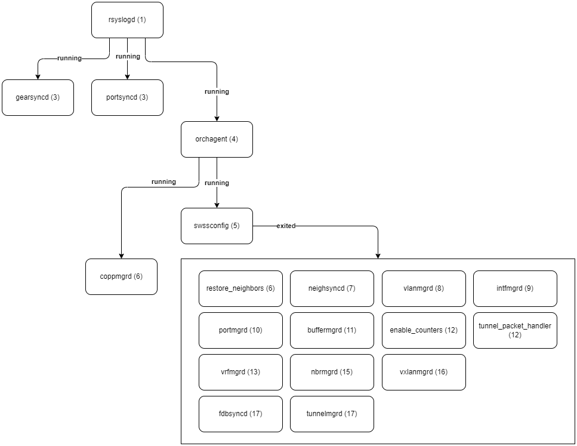

# Deep Dive: swss (Switch State Service)

SwSS レポジトリ： https://github.com/sonic-net/sonic-swss/

目次
- [swss (docker-orchagent) の全体像](#swss-docker-orchagent-の全体像)
  - [モジュールの起動シーケンス](#モジュールの起動シーケンス)

## swss (docker-orchagent) の全体像

Switch State Service の略である `swss container` は `database container` と共に SONiC システムの中核に位置し、各サブシステムやコンポーネント間を仲介する役割を担う、多くのモジュールから構成されます。

`swss container` の Docker Image 名は `docker-orchagent` で、以下モジュールが含まれます。

- swssconfig （起動時に実行され終了）
- orchagent
- portsyncd
- neighsyncd
- fdbsyncd
- gearsyncd
- coppmgrd
- vlanmgrd
- intfmgrd
- portmgrd
- buffermgrd
- vrfmgrd
- nbrmgrd
- vxlanmgrd
- tunnelmgrd

### モジュールの起動シーケンス

図：モジュール起動シーケンス（`docker-orchagent` 内の `/etc/supervisor/conf.d/supervisord.conf` ベース）

> TODO: docker-orchagent の起動シーケンスや設定ファイル、各モジュールの連携方法などの全体像を解説

1. rsyslogd の起動（ほぼ全てのサブシステムで最初に起動される）
2. grearsyncd
3. portsyncd
4. orchagent
5. swssconfig

コンテナ起動時に `swssconfig.sh` が実行され、状況に応じて設定をリストアや投入する。

- reboot 時はルート（ `/` ）直下のファイルを確認し、エントリをリストア
  - `fdb.json`, `arp.json`, ` default_routes.json`, `media_config.json`
- Warm Start の場合は何もせず終了（ `exit 0` ）
  - `SYSTEM_WARM_START`, `SWSS_WARM_START`
- Cold Start の場合は `/etc/swss/config.d/` の `ipinip.json ports.json switch.json vxlan.json` を読み込み設定投入（`APPL_DB`へ書き込み）

6. coppmgrd

`/usr/bin/coppmgrd` が実行される。

以降、swssconfig が exit した後に残りのモジュールが起動される。