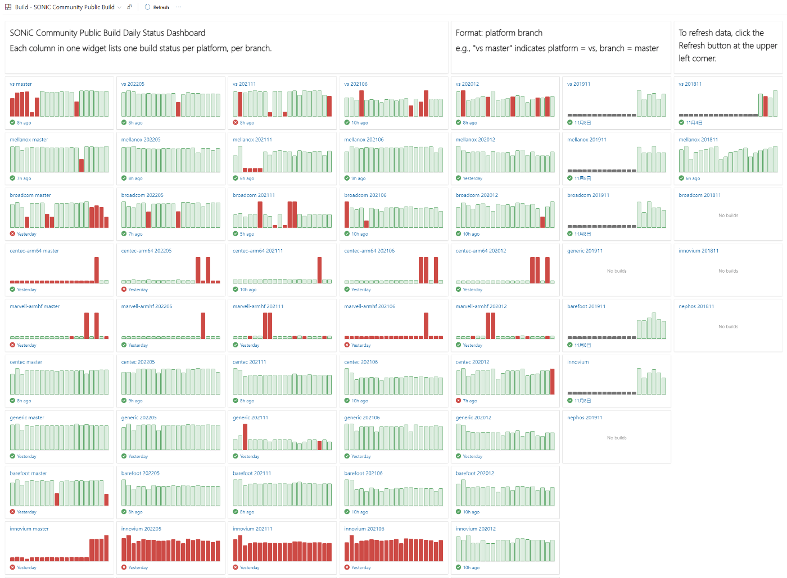

# SONiC pre-build image

自分で改造しない場合は、ビルド済みの image を利用可能です。

## Getting pre-built image

https://sonic-build.azurewebsites.net/ui/sonic/pipelines

- Find `Platform`, `BranchName` and click link on `Builds` (e.g. `vs`, `master`)
- Find the build you want to use and click `Artifacts`
  - make sure the `Result` is `succeeded`
- Click `Name` (e.g. `sonic-buildimage.vs1`)
- Download `*.img.gz` or `*.bin` (e.g. `target/sonic-vs.img.gz`, `target/sonic-broadcom.bin`)

## SONiC Daily Build 状況の確認方法

> [Zenn: SONiC Daily Build 状況の確認方法](https://zenn.dev/ebiken_sdn/articles/1999e629f0c4ea)

SONiC を利用する際は公式が提供しているビルド済みのイメージを利用するのが一番簡単であり、毎日リリースバージョンと main branch がビルドされている（Daily Build）ため、最新の機能追加やバグ修正（commit）を含むバージョンを試すことができます。

しかし、"本日のビルド" をダウンロードしに行くと Fail して存在しない場合もありますが、その状況としては以下のように様々なパターンがあります。

- たまたま今日だけ失敗した
- 最近ずっと Fail している（何か不具合がある）
- そのプラットフォーム×リリースをもうメンテしてない（毎回必ず失敗する）
- 利用したいプラットフォーム×リリースがどれに当てはまるのか？

今までは過去のビルド履歴を遡る必要がありましたが、そのような状況を一目で把握しやすくするために "ダッシュボード" が公開されました。

https://dev.azure.com/mssonic/build/_dashboards/dashboard/8cd564c6-a7e9-4451-a59e-776ff99f1ae0

> 棒１本の長さがビルド時間を表し、失敗（赤）成功（緑）ビルド無し（灰）で色分け  
> 各グラフの１番右側が直近で、左に行くほど１日づつ過去の履歴

例えば12月6日にスクショした上記ダッシュボードを見ると、一目で以下のようなことが推測できます。

- Mellanox は順調にビルドできてる
- Centecは不具合が多い
- Broadcom x master (main) ブランチは何か課題があり、解決されるまで利用できない可能性が高い（ここ４日間 Fail が続いている）
- innovium はもうメンテナンスしていない可能性が高い（202106以降のリリースは全てFailし続けている）

毎日更新されるダッシュボードですので、ぜひブックマークしておきましょう。