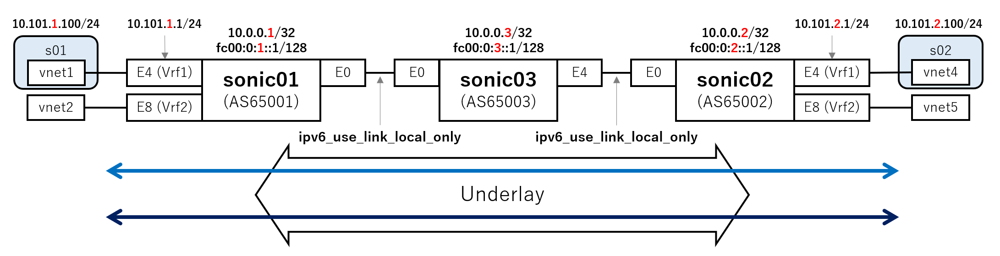

# SRv6 uSID with FRRouting

SONiC/FRR integration was ongoing on SONiC 202305 release but not merged. (as of 2023/08/18)

- 202305 SRv6 feature HLD (merged)
- [[fpmsyncd] Add support for SRv6](https://github.com/sonic-net/sonic-swss/pull/2515) (not merged)
  - fpmsyncd extension for FRR and SONiC integration via dplane_fpm_nl module

Cisco has published blog with sonic-vs image including SONiC/FRR integration.

https://www.segment-routing.net/blogs/srv6-usid-on-sonic/

This directory is a placeholder to note / store how to run uSID using SONiC/FRR using image and config examples on this blog.

## Resources

Direct link to the image is noted for convenience. Pls check the blog for the latest one.

- [sonic-srv6-vs-rev4.img (2.5GB)](https://onedrive.live.com/download?cid=266D2E4F35D86653&resid=266D2E4F35D86653%21138084&authkey=AN9P9j7tPoEU3iU)

Config files are modified based on the examples on the blog and GitHub repo.

- GitHub Repo: https://github.com/segmentrouting/srv6-labs/tree/main/sonic-vs
- config_db.json
- frr.conf
- TBD: sonic.xml

## Topology

Let's try with a simple topology.



Config of SONiC/FRR are defined in below files

- sonic-vs (KVM)
  - [kvm/sonic01.xml](kvm/sonic01.xml)
  - [kvm/sonic02.xml](kvm/sonic02.xml)
  - [kvm/sonic03.xml](kvm/sonic03.xml)
- SONiC
  - [sonic01/config_db.json](sonic01/config_db.json)
  - [sonic02/config_db.json](sonic02/config_db.json)
  - [sonic03/config_db.json](sonic03/config_db.json)
- FRR
  - [sonic01/frr.conf](sonic01/frr.conf)
  - [sonic02/frr.conf](sonic02/frr.conf)
  - [sonic03/frr.conf](sonic03/frr.conf)

s01, s02 is netns emulating hosts or remote site.
Config of netns are as below.


### netns host

apply this config **after** creating sonic-vs VM

```
ip netns add s01

ip link set vnet1 netns s01
ip netns exec s01 ip link set dev lo up
ip netns exec s01 ethtool --offload vnet1 rx off tx off
ip netns exec s01 ip addr add 10.101.1.100/24 dev vnet1
ip netns exec s01 ip link set dev vnet1 up
ip netns exec s01 ip route add default via 10.101.1.1
```

```
ip netns add s02

ip link set vnet4 netns s02
ip netns exec s02 ip link set dev lo up
ip netns exec s02 ethtool --offload vnet4 rx off tx off
ip netns exec s02 ip addr add 10.101.2.100/24 dev vnet4
ip netns exec s02 ip link set dev vnet4 up
ip netns exec s02 ip route add default via 10.101.2.1
```

## Start VM and Setup

### Start sonic-vs VM

copy sonic-vs image.

```
~/sonic-images$
sudo cp sonic-srv6-vs-rev4.img sonic-srv6-vs-rev4.1.img
sudo cp sonic-srv6-vs-rev4.img sonic-srv6-vs-rev4.2.img
sudo cp sonic-srv6-vs-rev4.img sonic-srv6-vs-rev4.3.img

$ sudo ls /var/lib/libvirt/images/
sonic-srv6-vs-rev4.1.img  sonic-srv6-vs-rev4.2.img  sonic-srv6-vs-rev4.3.img
```

FYI: Error message when using the same image for 2 VMs.

```
~$ virsh create sonic01.xml
error: Failed to create domain from sonic01.xml
error: internal error: process exited while connecting to monitor: 2023-08-18T09:07:41.585521Z qemu-system-x86_64: -drive file=/var/lib/libvirt/images/sonic-srv6-vs-rev4.img,format=qcow2,if=none,id=drive-virtio-disk0,cache=writeback: Failed to get "write" lock
Is another process using the image?
```

Create bridge

```
sudo -s
ip link add br01 type bridge
ip link add br02 type bridge
ip link add br03 type bridge
ip link add br04 type bridge
ip link set br01 up
ip link set br02 up
ip link set br03 up
ip link set br04 up
```

Start

```
~/sandbox/sonic-book/examples/srv6-usid/kvm$

virsh create sonic01.xml
virsh create sonic02.xml
virsh create sonic03.xml

$ virsh list
 Id    Name                           State
----------------------------------------------------
 10    sonic01                        running
 11    sonic02                        running
 12    sonic03                        running
```

Login via telnet console / ssh

```
> first telnet to port 7001,7002,7003 and check eth0 address
telnet localhost 7001

admin@sonic:~$ show ip int | grep eth0
eth0                   192.168.122.98/24   up/up         N/A             N/A

> ssh to eth0 (pass == YourPaSsWoRd)
> e.g. using sonic01,02,03 address in my env

ssh admin@192.168.122.98
ssh admin@192.168.122.170
ssh admin@192.168.122.242
```

### Replace and Apply config_db.json

> on host
```
scp sonic01/* admin@192.168.122.98:/home/admin/
scp sonic02/* admin@192.168.122.170:/home/admin/
scp sonic03/* admin@192.168.122.242:/home/admin/
```

> on sonic-vs
```
admin@sonic:~$ sudo cp config_db.json /etc/sonic/

admin@sonic:~$ sudo config reload
Clear current config and reload config in config_db format from the default config file(s) ? [y/N]: y
Disabling container monitoring ...
```

### sysctl config (sonic01,sonic02)

add below to the tail of `/etc/sysctl.conf` and restart.

> on sonic-vs (repeat on sonic02 and sonic03)
```
$ sudo vi /etc/sysctl.conf

net.vrf.strict_mode = 1 

$ sudo sysctl -p
```

### FRR config (vtysh)

apply FRR config on sonic-vs via vtysh

> on sonic-vs (repeat on sonic02 and sonic03)
```
admin@sonic01:~$ docker cp frr.conf bgp:/etc/frr/

> enter vtysh and remove unnessesary config
> listed are examples and could be more unnessesary config

admin@sonic01:~$ vtysh
sonic01# conf t
sonic01(config)#

no route-map RM_SET_SRC6 permit 10
no route-map RM_SET_SRC permit 10
no ip protocol bgp route-map RM_SET_SRC
no ipv6 protocol bgp route-map RM_SET_SRC6

> apply config
sonic01# copy /etc/frr/frr.conf running-config
```

## ping and capture packet

capture packet to confirm packet is encaped as SRv6 between sonic01~sonic03~sonic02.

```
> ping to sonic02 Ethernet4
ip netns exec s01 ping 10.101.2.1

> ping to s02 via sonic02 Ethernet4
ip netns exec s01 ping 10.101.2.100
```

capture packet

```
> host
sudo ip netns exec s01 tcpdump -i vnet1 -w host-vnet1-01.trc

> sonic01
sudo tcpdump -i Ethernet0 -w sonic01-E0-01.trc

> sonic03
sudo tcpdump -i Ethernet4 -w sonic03-E4-01.trc

> host
sudo ip netns exec s02 tcpdump -i vnet4 -w host-vnet4-01.trc
```

- [pkt/host-vnet1-01.trc](pkt/host-vnet1-01.trc)
- [pkt/host-vnet4-01.trc](pkt/host-vnet4-01.trc)
- [pkt/sonic01-E0-01.trc](pkt/sonic01-E0-01.trc)
- [pkt/sonic03-E4-01.trc](pkt/sonic03-E4-01.trc)

## output of interface, route table, APPL_DB etc.

### Interface setting (after config_db.json)

> snip docker0, lo for ipv4 and also eth0, Bridge for ipv6, linklocal for Vrf1/Vrf2

```
admin@sonic01:~$ show ip int
Interface    Master    IPv4 address/mask    Admin/Oper    BGP Neighbor    Neighbor IP
-----------  --------  -------------------  ------------  --------------  -------------
Ethernet4    Vrf1      10.101.1.1/24        up/up         N/A             N/A
Ethernet8    Vrf2      10.102.1.1/24        up/up         N/A             N/A
Loopback0              10.0.0.1/32          up/up         N/A             N/A
eth0                   192.168.122.98/24    up/up         N/A             N/A

admin@sonic02:~$ show ip int
Interface    Master    IPv4 address/mask    Admin/Oper    BGP Neighbor    Neighbor IP
-----------  --------  -------------------  ------------  --------------  -------------
Ethernet4    Vrf1      10.101.2.1/24        up/up         N/A             N/A
Ethernet8    Vrf2      10.102.2.1/24        up/up         N/A             N/A
Loopback0              10.0.0.2/32          up/up         N/A             N/A
eth0                   192.168.122.170/24   up/up         N/A             N/A

admin@sonic03:~$ show ip int
Interface    Master    IPv4 address/mask    Admin/Oper    BGP Neighbor    Neighbor IP
-----------  --------  -------------------  ------------  --------------  -------------
Loopback0              10.0.0.3/32          up/up         N/A             N/A
eth0                   192.168.122.242/24   up/up         N/A             N/A
```

```
admin@sonic01:~$ show ipv6 int
Interface    Master    IPv6 address/mask                       Admin/Oper    BGP Neighbor    Neighbor IP
-----------  --------  --------------------------------------  ------------  --------------  -------------
Ethernet0              fe80::5054:ff:fe74:c101%Ethernet0/64    up/up         N/A             N/A
Ethernet4    Vrf1      2001:0:101:1::1/64                      up/up         N/A             N/A
Ethernet8    Vrf2      2001:0:102:1::1/64                      up/up         N/A             N/A
Loopback0              fc00:0:1::1/128                         up/up         N/A             N/A

admin@sonic02:~$ show ipv6 int
Interface    Master    IPv6 address/mask                      Admin/Oper    BGP Neighbor    Neighbor IP
-----------  --------  -------------------------------------  ------------  --------------  -------------
Ethernet0              fe80::5054:ff:fe74:c102%Ethernet0/64   up/up         N/A             N/A
Ethernet4    Vrf1      2001:0:101:2::1/64                     up/up         N/A             N/A
Ethernet8    Vrf2      2001:0:102:2::1/64                     up/up         N/A             N/A
Loopback0              fc00:0:2::1/128                        up/up         N/A             N/A

admin@sonic03:~$ show ipv6 int
Interface    Master    IPv6 address/mask                       Admin/Oper    BGP Neighbor    Neighbor IP
-----------  --------  --------------------------------------  ------------  --------------  -------------
Ethernet0              fe80::5054:ff:fe74:c103%Ethernet0/64    up/up         N/A             N/A
Ethernet4              fe80::5054:ff:fe74:c103%Ethernet4/64    up/up         N/A             N/A
Loopback0              fc00:0:3::1/128                         up/up         N/A             N/A
```


### SONiC APPL_DB entries (SRV6_MY_SID_TABLE)

```
admin@sonic01:~$ sonic-db-cli APPL_DB keys "SRV6*" | while read -r key; do echo $key; sonic-db-cli APPL_DB HGETALL $key; done

SRV6_MY_SID_TABLE:32:16:16:0:fc00:0:1:6500::
{'action': 'udt46', 'vrf': 'Vrf1'}

SRV6_MY_SID_TABLE:32:16:16:0:fc00:0:1::
{'action': 'un'}

SRV6_SID_LIST_TABLE:fc00:0:2:6500::
{'path': 'fc00:0:2:6500::'}

SRV6_MY_SID_TABLE:32:16:16:0:fc00:0:1:6600::
{'action': 'udt46', 'vrf': 'Vrf2'}

SRV6_SID_LIST_TABLE:fc00:0:2:6600::
{'path': 'fc00:0:2:6600::'}
```

### SONiC APPL_DB entries (ROUTE_TABLE)

```
admin@sonic01:~$ sonic-db-cli APPL_DB keys "ROUTE_TABLE:Vrf*" | while read -r key; do echo $key; sonic-db-cli APPL_DB HGETALL $key;
 done

ROUTE_TABLE:Vrf1:2001:0:101:2::/64
{'segment': 'fc00:0:2:6500::', 'seg_src': 'fc00:0:1::1'}

ROUTE_TABLE:Vrf1:10.101.2.0/24
{'segment': 'fc00:0:2:6500::', 'seg_src': 'fc00:0:1::1'}

ROUTE_TABLE:Vrf2:2001:0:102:2::/64
{'segment': 'fc00:0:2:6600::', 'seg_src': 'fc00:0:1::1'}

ROUTE_TABLE:Vrf2:10.102.2.0/24
{'segment': 'fc00:0:2:6600::', 'seg_src': 'fc00:0:1::1'}
```

### Routing tables

> SONiC CLI
```
admin@sonic01:~$ show ipv6 route
Codes: K - kernel route, C - connected, S - static, R - RIP,
       O - OSPF, I - IS-IS, B - BGP, E - EIGRP, N - NHRP,
       T - Table, v - VNC, V - VNC-Direct, A - Babel, D - SHARP,
       F - PBR, f - OpenFabric,
       > - selected route, * - FIB route, q - queued route, r - rejected route

S>*fc00:0:1::/48 [1/0] is directly connected, eth0, 00:47:06
C>*fc00:0:1::1/128 is directly connected, Loopback0, 00:48:35
B>*fc00:0:1:6500::/128 [20/0] is directly connected, Vrf1, 00:47:06
B>*fc00:0:1:6600::/128 [20/0] is directly connected, Vrf2, 00:47:06
B>*fc00:0:2::/48 [20/0] via fe80::5054:ff:fe74:c103, Ethernet0, 00:43:36
B>*fc00:0:2::1/128 [20/0] via fe80::5054:ff:fe74:c103, Ethernet0, 00:43:36
B>*fc00:0:3::/48 [20/0] via fe80::5054:ff:fe74:c103, Ethernet0, 00:47:01
B>*fc00:0:3::1/128 [20/0] via fe80::5054:ff:fe74:c103, Ethernet0, 00:47:01
... snip directly connected ...

admin@sonic01:~$ show ip route vrf all
:
Codes: K - kernel route, C - connected, S - static, R - RIP,
       O - OSPF, I - IS-IS, B - BGP, E - EIGRP, N - NHRP,
       T - Table, v - VNC, V - VNC-Direct, A - Babel, F - PBR,
       f - OpenFabric,
       > - selected route, * - FIB route, q - queued, r - rejected, b - backup
       t - trapped, o - offload failure

VRF Vrf1:
C>* 10.101.1.0/24 is directly connected, Ethernet4, 23:50:58
B>* 10.101.2.0/24 [20/0] via fe80::5054:ff:fe74:c103, Ethernet0 (vrf default), label 413696, seg6local unspec unknown(seg6local_context2str), flavors unknown(seg6local_context2str), seg6 fc00:0:2:6500::, weight 1, 23:45:59

VRF Vrf2:
C>* 10.102.1.0/24 is directly connected, Ethernet8, 23:50:58
B>* 10.102.2.0/24 [20/0] via fe80::5054:ff:fe74:c103, Ethernet0 (vrf default), label 417792, seg6local unspec unknown(seg6local_context2str), flavors unknown(seg6local_context2str), seg6 fc00:0:2:6600::, weight 1, 23:45:59

VRF default:
K>* 0.0.0.0/0 [0/0] via 192.168.122.1, eth0, 23:50:58
C>* 10.0.0.1/32 is directly connected, Loopback0, 23:50:58
C>* 192.168.122.0/24 is directly connected, eth0, 23:50:58
```

> FRRouting vtysh
```
admin@sonic01:~$ vtysh -c "show ipv6 route"
Codes: K - kernel route, C - connected, S - static, R - RIPng,
       O - OSPFv3, I - IS-IS, B - BGP, N - NHRP, T - Table,
       v - VNC, V - VNC-Direct, A - Babel, F - PBR,
       f - OpenFabric,
       > - selected route, * - FIB route, q - queued, r - rejected, b - backup
       t - trapped, o - offload failure

S>* fc00:0:1::/48 [1/0] is directly connected, eth0, seg6local End USP, flavors next-csid lblen 32 nflen 16, seg6 ::, weight 1, 00:44:59
C>* fc00:0:1::1/128 is directly connected, Loopback0, 00:46:28
B>* fc00:0:1:6500::/128 [20/0] is directly connected, Vrf1, seg6local uDT46 unknown(seg6local_context2str), flavors unknown(seg6local_context2str), seg6 ::, weight 1, 00:44:59
B>* fc00:0:1:6600::/128 [20/0] is directly connected, Vrf2, seg6local uDT46 unknown(seg6local_context2str), flavors unknown(seg6local_context2str), seg6 ::, weight 1, 00:44:59
B>* fc00:0:2::/48 [20/0] via fe80::5054:ff:fe74:c103, Ethernet0, weight 1, 00:41:29
B>* fc00:0:2::1/128 [20/0] via fe80::5054:ff:fe74:c103, Ethernet0, weight 1, 00:41:29
B>* fc00:0:3::/48 [20/0] via fe80::5054:ff:fe74:c103, Ethernet0, weight 1, 00:44:54
B>* fc00:0:3::1/128 [20/0] via fe80::5054:ff:fe74:c103, Ethernet0, weight 1, 00:44:54
K>* fd00::/80 [0/1024] is directly connected, docker0 linkdown, 00:46:28
... snip directly connected ...

admin@sonic01:~$ vtysh -c "show ip route vrf all"
Codes: K - kernel route, C - connected, S - static, R - RIP,
       O - OSPF, I - IS-IS, B - BGP, E - EIGRP, N - NHRP,
       T - Table, v - VNC, V - VNC-Direct, A - Babel, F - PBR,
       f - OpenFabric,
       > - selected route, * - FIB route, q - queued, r - rejected, b - backup
       t - trapped, o - offload failure

VRF Vrf1:
C>* 10.101.1.0/24 is directly connected, Ethernet4, 23:53:18
B>* 10.101.2.0/24 [20/0] via fe80::5054:ff:fe74:c103, Ethernet0 (vrf default), label 413696, seg6local unspec unknown(seg6local_context2str), flavors unknown(seg6local_context2str), seg6 fc00:0:2:6500::, weight 1, 23:48:19

VRF Vrf2:
C>* 10.102.1.0/24 is directly connected, Ethernet8, 23:53:18
B>* 10.102.2.0/24 [20/0] via fe80::5054:ff:fe74:c103, Ethernet0 (vrf default), label 417792, seg6local unspec unknown(seg6local_context2str), flavors unknown(seg6local_context2str), seg6 fc00:0:2:6600::, weight 1, 23:48:19

VRF default:
K>* 0.0.0.0/0 [0/0] via 192.168.122.1, eth0, 23:53:18
C>* 10.0.0.1/32 is directly connected, Loopback0, 23:53:18
C>* 192.168.122.0/24 is directly connected, eth0, 23:53:18
```

> Linux Kernel
```
admin@sonic01:~$ ip -6 route
::1 dev lo proto kernel metric 256 pref medium
fc00:0:1::1 dev Loopback0 proto kernel metric 256 pref medium
fc00:0:1:6500:: nhid 260  encap seg6local action End.DT46 vrftable 1001 dev Vrf1 proto bgp metric 20 pref medium
fc00:0:1:6600:: nhid 261  encap seg6local action End.DT46 vrftable 1002 dev Vrf2 proto bgp metric 20 pref medium
fc00:0:1::/48 nhid 248  encap seg6local action End flavors next-csid lblen 32 nflen 16 dev eth0 proto 196 metric 20 pref medium
fc00:0:2::1 nhid 262 via fe80::5054:ff:fe74:c103 dev Ethernet0 proto bgp metric 20 pref medium
fc00:0:2::/48 nhid 262 via fe80::5054:ff:fe74:c103 dev Ethernet0 proto bgp metric 20 pref medium
fc00:0:3::1 nhid 262 via fe80::5054:ff:fe74:c103 dev Ethernet0 proto bgp metric 20 pref medium
fc00:0:3::/48 nhid 262 via fe80::5054:ff:fe74:c103 dev Ethernet0 proto bgp metric 20 pref medium
...snip...

admin@sonic01:~$ ip -6 route show vrf Vrf1
anycast 2001:0:101:1:: dev Ethernet4 proto kernel metric 0 pref medium
2001:0:101:1::/64 dev Ethernet4 proto kernel metric 256 pref medium
2001:0:101:2::/64 nhid 255  encap seg6 mode encap segs 1 [ fc00:0:2:6500:: ] via fe80::5054:ff:fe74:c103 dev Ethernet0 proto bgp metric 20 pref medium
anycast fe80:: dev Ethernet4 proto kernel metric 0 pref medium
fe80::/64 dev Ethernet4 proto kernel metric 256 pref medium
multicast ff00::/8 dev Ethernet4 proto kernel metric 256 pref medium
admin@sonic01:~$


admin@sonic01:~$ ip -6 route show vrf Vrf2
anycast 2001:0:102:1:: dev Ethernet8 proto kernel metric 0 pref medium
2001:0:102:1::/64 dev Ethernet8 proto kernel metric 256 pref medium
2001:0:102:2::/64 nhid 256  encap seg6 mode encap segs 1 [ fc00:0:2:6600:: ] via fe80::5054:ff:fe74:c103 dev Ethernet0 proto bgp metric 20 pref medium
anycast fe80:: dev Ethernet8 proto kernel metric 0 pref medium
fe80::/64 dev Ethernet8 proto kernel metric 256 pref medium
multicast ff00::/8 dev Ethernet8 proto kernel metric 256 pref medium

admin@sonic01:~$ ip route show
default via 192.168.122.1 dev eth0
192.168.122.0/24 dev eth0 proto kernel scope link src 192.168.122.98
240.127.1.0/24 dev docker0 proto kernel scope link src 240.127.1.1 linkdown

admin@sonic01:~$ ip route show vrf Vrf1
10.101.1.0/24 dev Ethernet4 proto kernel scope link src 10.101.1.1
10.101.2.0/24 nhid 255  encap seg6 mode encap segs 1 [ fc00:0:2:6500:: ] via inet6 fe80::5054:ff:fe74:c103 dev Ethernet0 proto bgp metric 20

admin@sonic01:~$ ip route show vrf Vrf2
10.102.1.0/24 dev Ethernet8 proto kernel scope link src 10.102.1.1
10.102.2.0/24 nhid 256  encap seg6 mode encap segs 1 [ fc00:0:2:6600:: ] via inet6 fe80::5054:ff:fe74:c103 dev Ethernet0 proto bgp metric 20
```

## debug

### route was rejected with unnessesary config

```
>>> NG
B>r fc00:0:2:6500::/128 [20/0] is directly connected, Vrf1, seg6local uDT46 unknown(seg6local_context2str), flavors unknown(seg6local_context2str), seg6 ::, weight 1, 01:44:25
>>> OK
B>* fc00:0:2:6500::/128 [20/0] is directly connected, Vrf1, seg6local uDT46 unknown(seg6local_context2str), flavors unknown(seg6local_context2str), seg6 ::, weight 1, 00:09:54
```

Fixed by removing config below.

```
admin@sonic01:~$ vtysh
sonic01# conf t
sonic01(config)#

no route-map RM_SET_SRC6 permit 10
no route-map RM_SET_SRC permit 10
no ip protocol bgp route-map RM_SET_SRC
no ipv6 protocol bgp route-map RM_SET_SRC6
```

### static neigh (static arp)

Used for debugging. But should not be required after creating netns s01, s02.

```
> host
sudo ip neigh add 10.101.1.1 lladdr 52:54:00:74:c1:01 dev vnet1

> sonic01
sudo ip neigh del 10.101.1.100 dev Ethernet4
sudo ip neigh add 10.101.1.100 lladdr fe:54:00:11:01:01 dev Ethernet4
```

memo

```
sonic-book/examples/srv6-usid$ ip a show vnet1
223: vnet1: <BROADCAST,MULTICAST,UP,LOWER_UP> mtu 1500 qdisc fq_codel master br01 state UNKNOWN group default qlen 1000
    link/ether fe:54:00:11:01:01 brd ff:ff:ff:ff:ff:ff
    inet 10.101.1.100/24 scope global vnet1
       valid_lft forever preferred_lft forever
    inet6 fe80::fc54:ff:fe11:101/64 scope link
       valid_lft forever preferred_lft forever
```
